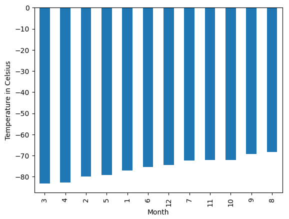
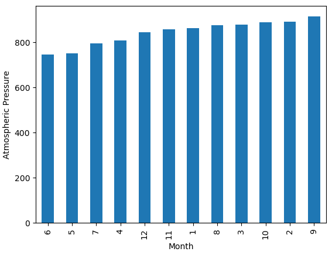
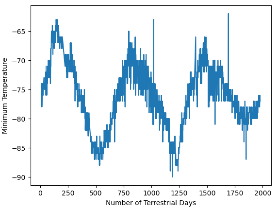

# Data-Collection-Challenge
This repository is for the Data Analytics Bootcamp Module 11 Challenge

The first portion of this challenge involved scraping titles and preview text from articles on the Mars news website (https://static.bc-edx.com/data/web/mars_news/index.html). All of the information requested can be found within the part_1_mars_news.ipynb file.

The second portion of this challenge involved scraping information from a table on the Mars temperature date website (https://static.bc-edx.com/data/web/mars_facts/temperature.html). All of the information requested can be found within the part_2_mars_weather.ipynb file, as well as the Resources folder.

I was able to explore the relationship between month and temperature on Mars: 

On average, the third month has the coldest minimum temperature on Mars, and the eighth month is the warmest. But it is always very cold there in human terms!

I was also able to explore the relationship between month and pressure on Mars:

Atmospheric pressure is, on average, lowest in the sixth month and highest in the ninth.

Finally, I explored the relationship between terrestrial (Earth) days and temperature on Mars:

The distance from peak to peak is roughly 1425-750, or 675 days. A year on Mars appears to be about 675 days from the plot. Internet search confirms that a Mars year is equivalent to 687 earth days.

I referenced class activities and instruction provided by Instructor Brett Barnes and TA Ally Qi to complete this activity.
